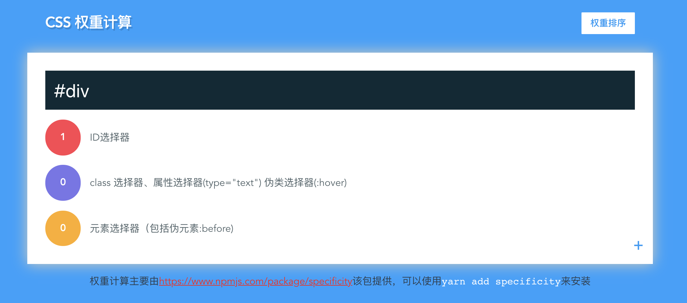

# css-specificity-calculator
一个对CSS 选择器权重计算的网站

## 使用
打开[https://css-specificity-calculator-gflmszgtt.now.sh](https://css-specificity-calculator-gflmszgtt.now.sh)

如下：


在输入框中输入`CSS specificity`

```css
div li a 
html
#id
.class
```